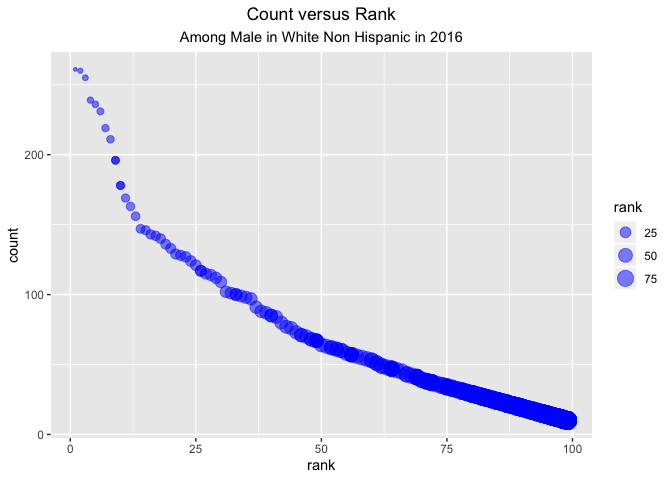

p8105\_hw2\_ss5929
================
Shuyi SHEN
9/24/2019

## Problem 1

``` r
library(tidyverse)
```

    ## ── Attaching packages ─────────────────────────────────────────────────────────────── tidyverse 1.2.1 ──

    ## ✔ ggplot2 3.2.1     ✔ purrr   0.3.2
    ## ✔ tibble  2.1.3     ✔ dplyr   0.8.3
    ## ✔ tidyr   1.0.0     ✔ stringr 1.4.0
    ## ✔ readr   1.3.1     ✔ forcats 0.4.0

    ## ── Conflicts ────────────────────────────────────────────────────────────────── tidyverse_conflicts() ──
    ## ✖ dplyr::filter() masks stats::filter()
    ## ✖ dplyr::lag()    masks stats::lag()

``` r
library(readxl)

TrashData = read_excel("data/HealthyHarborWaterWheelTotals2018-7-28.xlsx",
                       sheet = 1,
                       range = "A2:N338"
                       ) %>%
           janitor::clean_names() %>%
           drop_na  (dumpster) %>%
           mutate_at(vars(sports_balls),round,0) 
         
pre_2017 = read_excel("data/HealthyHarborWaterWheelTotals2018-7-28.xlsx",
                       sheet = 4,
                       skip  = 1) %>% 
  janitor::clean_names() %>% 
  drop_na() %>% 
  mutate( year= "2017" )

pre_2018 = read_excel("data/HealthyHarborWaterWheelTotals2018-7-28.xlsx",
                       sheet = 3,
                       skip  = 1) %>%
  janitor::clean_names() %>% 
  drop_na() %>% 
  mutate( year= "2018" ) 

pre_da = rbind(pre_2017,pre_2018) %>%
mutate(month = month.name[month]) 
```

**Summary**

*TrashData*

There are 285 observations in the `TrashData`dataset with 14 variables
including information on the dumpster number,date of collection(`month,
year, date`),amount of total litter(`weight_tons, volume_cubic_yards`),
litter type(`plastic_bottles, polystyrene, cigarette_butts,
glass_bottles, grocery_bags, chip_bags, sports_balls`) and
`homes_powered`(each ton of trash equates to on average 500 kilowatts of
electricity and an average household will use 30 kilowatts per day ).

*pre\_2017*

There are 12 observations in the `pre_2017` dataset with 3 variables
including `month, total, year`. The key variable is `total`, which means
the total precipitation in that month

*pre\_2018*

There are 7 observations in the `pre_2018` dataset with 3 variables
including `month, total, year`. The key variable is `total`, which means
the total precipitation in that month

*pre\_da*

There are 19 observations with 3 variables including `month, total,
year` in the `pre_da` dataset. The key variable is `total`, which means
the total precipitation in that month that year.

The total precipitation in 2018 is 23.5.

The median number of sports balls in a dumpster in 2017 is 8.

## Problem 2

``` r
pols<-read_csv("data/fivethirtyeight_datasets/pols-month.csv") %>%
   janitor::clean_names() %>%
   separate(mon,sep="-",into = c("year","month","day")) %>%  
   mutate(month=as.numeric(month))%>%
   mutate(month=month.name[month])%>%
   pivot_longer(
    cols         = starts_with("prez"),
    names_to     = "president",
    names_prefix = "prez_"
   )%>% 
   filter(value!="0") %>%
   select(-value) %>%
   select(-day) 

snp<-read_csv("data/fivethirtyeight_datasets/snp.csv") %>%
  janitor::clean_names() %>%
  separate(date,sep="/",into = c("month","day","year")) %>% 
   mutate (month=as.numeric(month))%>%
   arrange(year,month) %>% 
   mutate (month=month.name[month]) %>%
   select (year,month, close) 

pols_snp <- left_join(pols,snp,by=c("year","month")) 

unemployment<-read_csv("data/fivethirtyeight_datasets/unemployment.csv") %>%
  janitor::clean_names()%>%
  pivot_longer(
     jan:dec,
     names_to = "month" 
) %>% 
mutate(year  = as.character(year)) %>%
mutate(month = factor(month)) %>%
mutate(month = month.name[month])   

result<-left_join(pols_snp,unemployment,by=c("year","month"))
```

**Summary**

*pols*

There are 822 objects with 9 variables in `pols` dataset. The variables
are:

`year`: the associated year

`month`: the associated month

`gov_gop`: the number of republican governors on the associated date

`sen_gop`: the number of republican senators on the associated date

`rep_gop`: the number of republican representatives on the associated
date

`gov_dem`: the number of democratic governors on the associated date

`sen_dem`: the number of democratic senators on the associated date

`rep_dem`: the number of democratic representatives on the associated
date

`president`: whether the president was republican or democratic on the
associated date

and key variables are `gov_gop, sen_gop, rep_gop, gov_dem, sen_dem,
rep_dem, president`

The range of years is from 1947 to 2015.

*snp*

There are 787 objects with 3 variables in `snp` dataset. The variables
are `year, month, close` and key variables is `close` indicating the
closing values of the S\&P stock index on the associated date

The range of years is from 1950 to 2015.

*unemployment*

There are 816 objects with 3 variables in `umemployment` dataset. The
variables are `year, month, value` and key variables is `value`
indicating percentage of unemployment in that month in that year.

The range of years is from 1948 to 2015.

*result*

There are 822 objects with 11 variables in `result` dataset. The
variables are `year, month, gov_gop, sen_gop, rep_gop, gov_dem, sen_dem,
rep_dem, president, close, value`.

The range of years is from 1947 to 2015 .

## Problem 3

``` r
library(ggplot2)

BabyNames = read_csv("data/Popular_Baby_Names.csv") %>% 
  janitor::clean_names() %>% 
  distinct()%>% 
  mutate(childs_first_name=str_to_lower(childs_first_name)) %>%
  mutate(
    ethnicity=recode(ethnicity,"WHITE NON HISP"="WHITE NON HISPANIC",
                               "BLACK NON HISP"="BLACK NON HISPANIC",
                               "ASIAN AND PACI"="ASIAN AND PACIFIC ISLANDER")
  ) 
  
Olivia=BabyNames %>%
filter(childs_first_name=="olivia")   
 tibble(
    year      = Olivia$year_of_birth,
    ethnicity = Olivia$ethnicity,
    rank      = Olivia$rank
  ) %>% 
  pivot_wider(
    names_from  = "year",
    values_from = "rank" 
  ) %>% 
      knitr::kable(format="html")
```

<table>

<thead>

<tr>

<th style="text-align:left;">

ethnicity

</th>

<th style="text-align:right;">

2016

</th>

<th style="text-align:right;">

2015

</th>

<th style="text-align:right;">

2014

</th>

<th style="text-align:right;">

2013

</th>

<th style="text-align:right;">

2012

</th>

<th style="text-align:right;">

2011

</th>

</tr>

</thead>

<tbody>

<tr>

<td style="text-align:left;">

ASIAN AND PACIFIC ISLANDER

</td>

<td style="text-align:right;">

1

</td>

<td style="text-align:right;">

1

</td>

<td style="text-align:right;">

1

</td>

<td style="text-align:right;">

3

</td>

<td style="text-align:right;">

3

</td>

<td style="text-align:right;">

4

</td>

</tr>

<tr>

<td style="text-align:left;">

BLACK NON HISPANIC

</td>

<td style="text-align:right;">

8

</td>

<td style="text-align:right;">

4

</td>

<td style="text-align:right;">

8

</td>

<td style="text-align:right;">

6

</td>

<td style="text-align:right;">

8

</td>

<td style="text-align:right;">

10

</td>

</tr>

<tr>

<td style="text-align:left;">

HISPANIC

</td>

<td style="text-align:right;">

13

</td>

<td style="text-align:right;">

16

</td>

<td style="text-align:right;">

16

</td>

<td style="text-align:right;">

22

</td>

<td style="text-align:right;">

22

</td>

<td style="text-align:right;">

18

</td>

</tr>

<tr>

<td style="text-align:left;">

WHITE NON HISPANIC

</td>

<td style="text-align:right;">

1

</td>

<td style="text-align:right;">

1

</td>

<td style="text-align:right;">

1

</td>

<td style="text-align:right;">

1

</td>

<td style="text-align:right;">

4

</td>

<td style="text-align:right;">

2

</td>

</tr>

</tbody>

</table>

``` r
names_male=BabyNames %>% 
  filter(gender == "MALE",rank==1) %>% 
  select(year_of_birth,childs_first_name,ethnicity) %>% 
  pivot_wider(
    names_from  = "year_of_birth",
    values_from = "childs_first_name"
  ) 
names_male %>% knitr::kable(format = "html")
```

<table>

<thead>

<tr>

<th style="text-align:left;">

ethnicity

</th>

<th style="text-align:left;">

2016

</th>

<th style="text-align:left;">

2015

</th>

<th style="text-align:left;">

2014

</th>

<th style="text-align:left;">

2013

</th>

<th style="text-align:left;">

2012

</th>

<th style="text-align:left;">

2011

</th>

</tr>

</thead>

<tbody>

<tr>

<td style="text-align:left;">

ASIAN AND PACIFIC ISLANDER

</td>

<td style="text-align:left;">

ethan

</td>

<td style="text-align:left;">

jayden

</td>

<td style="text-align:left;">

jayden

</td>

<td style="text-align:left;">

jayden

</td>

<td style="text-align:left;">

ryan

</td>

<td style="text-align:left;">

ethan

</td>

</tr>

<tr>

<td style="text-align:left;">

BLACK NON HISPANIC

</td>

<td style="text-align:left;">

noah

</td>

<td style="text-align:left;">

noah

</td>

<td style="text-align:left;">

ethan

</td>

<td style="text-align:left;">

ethan

</td>

<td style="text-align:left;">

jayden

</td>

<td style="text-align:left;">

jayden

</td>

</tr>

<tr>

<td style="text-align:left;">

HISPANIC

</td>

<td style="text-align:left;">

liam

</td>

<td style="text-align:left;">

liam

</td>

<td style="text-align:left;">

liam

</td>

<td style="text-align:left;">

jayden

</td>

<td style="text-align:left;">

jayden

</td>

<td style="text-align:left;">

jayden

</td>

</tr>

<tr>

<td style="text-align:left;">

WHITE NON HISPANIC

</td>

<td style="text-align:left;">

joseph

</td>

<td style="text-align:left;">

david

</td>

<td style="text-align:left;">

joseph

</td>

<td style="text-align:left;">

david

</td>

<td style="text-align:left;">

joseph

</td>

<td style="text-align:left;">

michael

</td>

</tr>

</tbody>

</table>

``` r
BabyNames %>%
  filter(gender=="MALE",
         ethnicity=="WHITE NON HISPANIC", 
         year_of_birth=="2016") %>% 
  ggplot     (aes(x=rank,y=count))+
  geom_point (aes(size=rank),alpha=.5,color="blue")+
  geom_smooth(se=FALSE,color="black")+
  labs       (title = "Count versus Rank", subtitle="Among Male in White Non Hispanic in 2016")+
  theme      (plot.title=element_text(hjust=0.5),plot.subtitle = element_text(hjust = 0.5))
```

<!-- -->
**Summary**

*BabyNames*

There are 12181 observations with 6 variables in the dataset. The
variables are `year_of_birth`: year of birth

`gender`: sex of the baby

`ethnicity`: mother’s ethnicity

`childs_first_name`: child’s first name

`count`: number of babies with this name

`rank`: frequency of baby names in descending order

and key variables are `childs_first_name, count, rank`

*Olivia*

There are 3 varibles in this dataset including `year`,`ethnicity` and
`rank` indicating the rank of Olivia among female in different ethnicity
in different years.

*names\_male*

There are 3 variables in this dataset including `year`,`ethnicity` and
`childs_first_name` indicating the most popular name among male in
different ethnicity over time.

*plot*

The graph shows the increase of count with the decrease of rank among
male in white non hispanic in 2016. The xlab is rank while the ylab is
count and the point means one specific childs\_first\_name.
